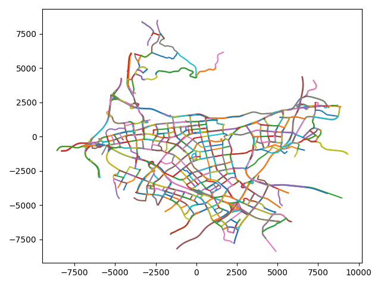

# MMVC_de_com
The released dataset of "Vehicle Trajectory Recovery on Road Network Based on Traffic Camera Video Data" from SIGSpatial 2021.

You can download the anonymized dataset from [here](https://cloud.tsinghua.edu.cn/d/3c8bf23a1d5a4be5a20e/).

# Dataset Details

This dataset includes the following files:

* `records.json`: 4.9 millions of records processed from raw photos taken by cameras installed on junctions.
* `cameras.json`: IDs and positions of the cameras.
* `trajectories.json`: Ground truth trajectories.
* `map.json`: Map of the area.

**NOTE**

* Anonymization methods are applied to coordinates, plates, etc. due to privacy concerns.
* All distances are in meters and time in seconds.

## cameras.json

Each line in the file describes one camera in JSON format.

```json
{
  "camera_id": 0, // camera ID
  "position": [   // camera position in (x, y)
    3630.3833603831476,
    -972.9560952274907
  ]
}

```

Example code for loading:

```python
import json
cameras=[]
with open('cameras.json') as file:
  for l in file:
    cameras.append(json.loads(l))

```

## trajectories.json

Each line in this file describes a trajectory.

```json
{
  "vehicle_id": 0,  // vehicle ID
  "xyt": [          // trajectory in (x, y, timestamp)
    [4969.375038342581, 326.265524591196, -2553.0],
    [4966.193035697625, 334.52332802308206, -2487.0],
    ...
  ]
}

```

Example code for loading:

```python
import json
trajectories=[]
with open('trajectories.json') as file:
  for l in file:
    trajectories.append(json.loads(l))

```

## records.json

The complete file can be extracted from `records.7z.001` and `records.7z.002`. A sample from it is `records.sample.json`, which contains the first 1000 lines.

Each line of the file describes one record. The original photos are processed to obtain `car_feature`, `plate_feature` and OCR text `plate_text`. Note that `plate_feature` and `plate_text` is only available if the plate is recognized from the photo. `vehicle_id` is available for annotated records and corresponds to the same field in `trajectories.json`.

```json
{
  "vehicle_id": 148,          // vehicle ID
  "camera_id": 92,            // camera ID, as in `cameras.json`
  "car_feature": "Vr...A==",  // 256 float32 numbers encoded in base64
  "plate_feature": "h3...Q==",// same as above
  "plate_text": "B;7QQg#",    // obfuscated plate OCR result
  "time": 8852                // time
}

{
  "vehicle_id": null,         // missing (this record is not annotated)
  "camera_id": 92,
  "car_feature": "Fp...A==",
  "plate_feature": null,      // missing (plate is not recognized)
  "plate_text": null,         // missing (plate is not recognized)
  "time": 7960
}

```

Example code for processing `car_feature` and `plate_feature` in python:

```python
import numpy as np
import base64
import json

def from_base64(s):
  return np.frombuffer(base64.b64decode(s), np.float32)

records=[]
with open('records.sample.json') as file:
  for l in file:
    r=json.loads(l)
    r['car_feature']=from_base64(r['car_feature'])
    if r['plate_feature'] is not None:
      r['plate_feature']=from_base64(r['plate_feature'])
    records.append(r)

```

## map.json

This file contains a list of map elements in JSON format.



There are two types of elements, `node` and `way`. 

```json
{
  "type": "node",
  "id": 8269,
  "xy": [ // position in (x, y)
    -3327.1847976283175,
    -3134.0369391959953
  ]
}

{
  "type": "way",
  "id": 8270,
  "level": 0, // level of the road, the smaller the higher
  "oneway": true, // whether it is an one-way road
  "nodes": [ // node IDs, describes the geometry of the road and implies connection with other roads
    211,
    209,
    1027
  ]
}

```

Example code for loading:

```python
import json
map_=json.load(open('map.json'))

```

